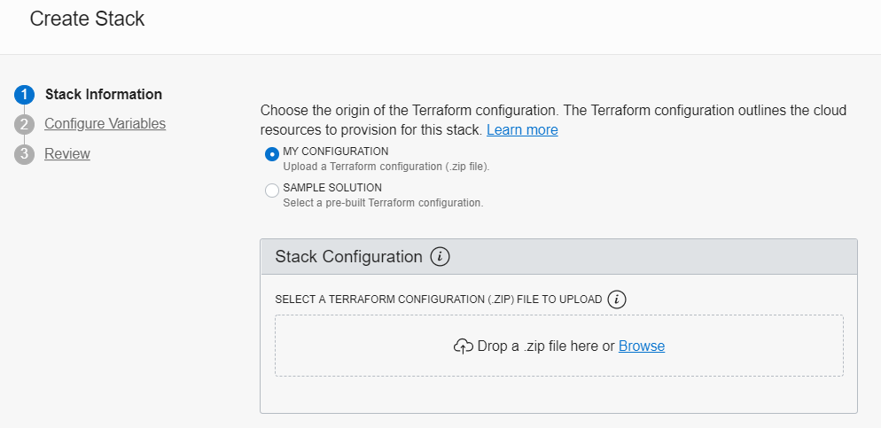
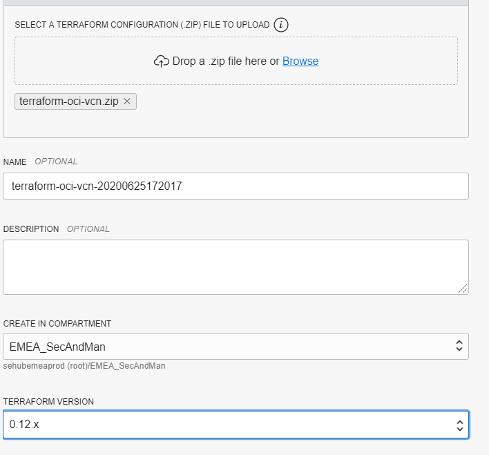
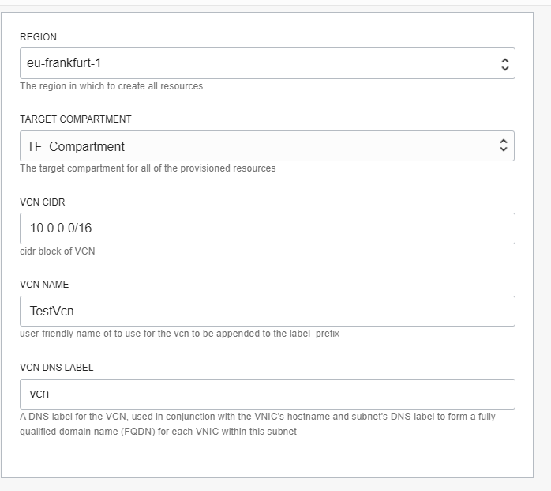
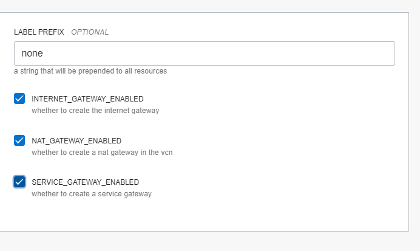
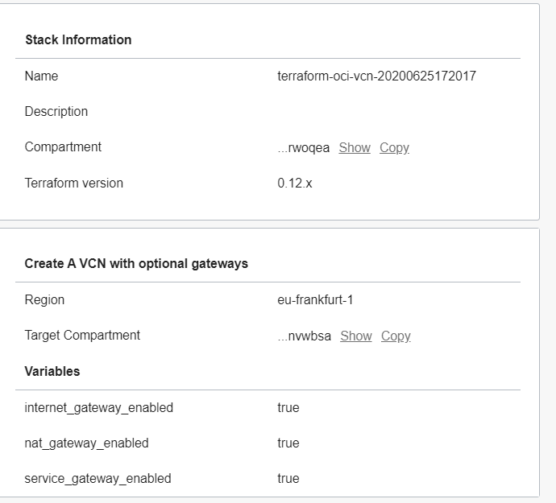
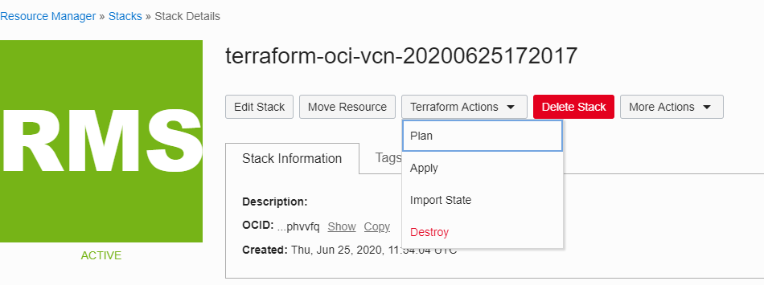
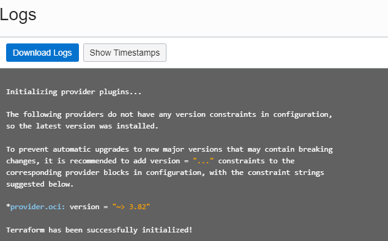

# Using Resource Manager

[Overview](https://docs.cloud.oracle.com/en-us/iaas/Content/ResourceManager/Concepts/resourcemanager.htm)
[Create Stack](https://docs.cloud.oracle.com/en-us/iaas/Content/ResourceManager/Tasks/managingstacksandjobs.htm)

Step by step instructions:

```bash
git clone https://github.com/oracle-terraform-modules/terraform-oci-vcn.git
zip terraform-oci-vcn.zip *.tf schema.yaml -x main.tf
```

1. Create a stack:
   

2. Upload the zip file:
   

3. Configure variables as needed:
   

4. Check the relevant boxes if you need gateways:
   

5. Review your stack:
   

6. Run Terraform plan and apply:
   

7. Check the logs:
   
